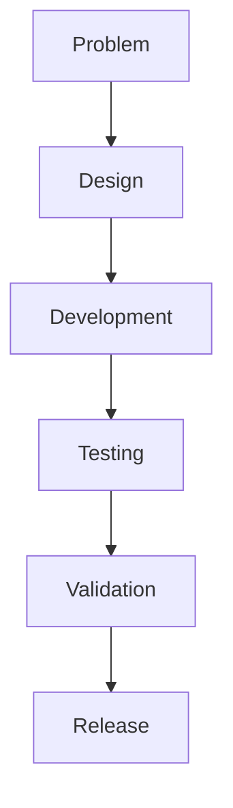

# WeianData Engineering Handbook Master Specification

Version: 1.0

Status: Approved

Owner: WeianData

Priority: Highest

---

# Purpose

This document defines the overall architecture, design philosophy, writing standards, governance model, and long-term development strategy for the WeianData Engineering Handbook.

This specification is the highest-level engineering document within WeianData.

It serves as the constitution governing all handbook documents.

Any handbook chapter, engineering standard, workflow, or policy must comply with this specification.

If any conflict exists, this specification takes precedence.

---

# Vision

The Engineering Handbook is not a collection of Markdown documents.

It is the Engineering Operating System (Engineering OS) of WeianData.

Its purpose is to preserve engineering knowledge, standardize development practices, support AI-assisted engineering, and ensure long-term maintainability.

The handbook should remain useful for at least the next ten years without requiring structural redesign.

---

# Mission

The Engineering Handbook should become the single source of truth for every engineering activity inside WeianData.

It defines:

- How software is developed.
- How statistical methods are implemented.
- How AI participates in engineering.
- How client projects are delivered.
- How engineering knowledge is preserved.
- How future engineers and AI agents collaborate.

---

# Engineering Manifesto

Professional measurement is our foundation.

Artificial intelligence is our accelerator.

Engineering excellence is our commitment.

We build trustworthy software for trustworthy measurement.

---

# Engineering Principles

Every engineering decision should follow these principles.

1. Engineering serves science.
2. Statistical correctness outweighs implementation convenience.
3. Documentation is part of the product.
4. Engineering knowledge belongs to the company.
5. Reproducibility is non-negotiable.
6. AI augments expertise but never replaces scientific judgment.
7. Simple systems are preferred.
8. Automation should reduce repetitive work.
9. Every engineering decision should be explainable.
10. Long-term maintainability is more important than short-term productivity.

---

# Handbook Architecture

The Engineering Handbook is organized into four hierarchical levels.

Level 0

Engineering Principles

Defines the engineering culture and philosophy.

Contains no implementation details.

---

Level 1

Authoring Constitution

Defines how handbook documents are written.

Defines immutable authoring rules.

Defines consistency requirements.

Defines writing standards.

No handbook document may violate these rules.

---

Level 2

Engineering Handbook Specification

Defines:

- handbook architecture
- directory structure
- chapter design
- document lifecycle
- quality requirements
- review process

---

Level 3

Engineering Handbook

Contains all engineering standards.

Examples:

- Engineering Workflow
- Git Standards
- Repository Standards
- Statistical Validation
- AI Development Policy
- Security Policy

---

# Directory Structure

.github/

handbook/

SPECIFICATION/

engineering-handbook-master-specification.md

handbook-authoring-rules.md

engineering-handbook-specification.md

handbook-review-standard.md

handbook-style-guide.md

handbook-roadmap.md

chapters/

00-engineering-handbook.md

01-engineering-workflow.md

02-repository-standards.md

...

README.md

profile/

README.md

---

# Handbook Structure

The handbook should be organized as follows.

Part I

Engineering Principles

- Welcome
- Company Mission
- Engineering Philosophy
- Engineering Workflow

Part II

Software Engineering

- Repository Standards
- Git Standards
- Branching Strategy
- Commit Convention
- Coding Standards
- Documentation Standards
- Release Process

Part III

Statistical Engineering

- Statistical Validation
- Research Workflow
- Reproducibility Standard
- Simulation Standard
- Benchmark Standard

Part IV

AI Engineering

- AI Development Policy
- Prompt Engineering
- AI Agent Collaboration
- AI Code Review
- AI Knowledge Management

Part V

Security & Governance

- Security Policy
- Client Data Policy
- Repository Governance
- Architecture Decision Records
- Dependency Management

Part VI

Open Source

- Open Source Policy
- Repository Template
- README Standard
- Issue Template
- Pull Request Standard
- Community Guidelines

Appendix

- Naming Convention
- File Structure Convention
- Versioning Guide
- Glossary

---

# Authoring Constitution

The handbook follows immutable authoring rules.

Every chapter must:

- be independent
- be maintainable
- be reproducible
- remain AI-readable
- remain human-readable
- avoid duplicated standards
- avoid conflicting rules
- avoid temporary engineering decisions

The handbook should always have a single source of truth.

A rule should exist in only one chapter.

Other chapters should reference it instead of duplicating it.

---

# Writing Standards

All handbook documents must be written in English.

Writing style should be:

- professional
- concise
- objective
- engineering-oriented

Avoid:

- marketing language
- motivational writing
- exaggerated wording
- unnecessary adjectives

---

# Standard Chapter Structure

Every chapter should follow the same structure.

1. Purpose
2. Scope
3. Philosophy
4. Principles
5. Standards
6. Best Practices
7. Examples
8. Checklist
9. Summary
10. References (optional)

Consistency is more important than creativity.

---

# Markdown Standards

Use standard GitHub Markdown.

Use:

- headings
- tables
- lists
- fenced code blocks
- Mermaid diagrams

Avoid unnecessary HTML.

Every code block should specify its language.

---

# Naming Standards

Documents:

lowercase

hyphen-separated

Examples:

git-standards.md

repository-standards.md

engineering-workflow.md

Avoid:

GitStandard.md

FinalVersion.md

README2.md

---

# Numbering Rules

All handbook chapters use ordered numbering.

Example:

00-engineering-handbook.md

01-engineering-workflow.md

02-repository-standards.md

...

Numbers represent reading order.

---

# Diagram Standards

Prefer Mermaid diagrams whenever practical.

Example:

ASCII diagrams are acceptable only when simpler.

---

# Documentation Standards

Every chapter should contain:

- practical examples
- engineering rationale
- implementation guidance
- review checklist

Operational chapters should end with actionable checklists.

---

# AI Compatibility

The handbook is designed for both humans and AI.

Every chapter should be:

- machine-readable
- unambiguous
- logically structured
- deterministic

AI assistants should be able to execute handbook standards without requiring interpretation.

---

# Quality Requirements

Every handbook document must satisfy:

Correct

Complete

Consistent

Maintainable

Reproducible

Professionally written

AI-readable

Future-proof

---

# Review Process

Every handbook document should be reviewed for:

- engineering accuracy
- statistical accuracy
- language quality
- duplicate content
- conflicting standards
- maintainability

Major revisions should update the handbook version.

---

# Versioning

Semantic Versioning.

Major

Structural redesign.

Minor

New engineering standards.

Patch

Corrections.

---

# Long-Term Goals

The Engineering Handbook should eventually become the engineering operating system of WeianData.

Future software repositories, AI agents, engineering workflows, statistical tools, consulting projects, and open-source software should all inherit from this handbook.

No engineering practice should exist outside the handbook.

---

# Success Criteria

The handbook is considered successful if:

- A new engineer can understand WeianData's engineering system within two hours.
- AI coding assistants can follow the handbook without ambiguity.
- Engineering knowledge is preserved independently of individuals.
- New repositories automatically inherit handbook standards.
- Statistical software development follows reproducible engineering practices.
- Client delivery quality remains consistent across projects.
- Engineering culture remains stable as the company grows.

---

# Future Evolution

The handbook is a living engineering system.

It should evolve gradually without breaking existing standards.

Every new standard should strengthen consistency rather than increase complexity.

Engineering processes should remain as simple as possible while supporting future growth.

---

© WeianData

Engineering knowledge is one of the company's most valuable assets.

Build systems that outlive their creators.