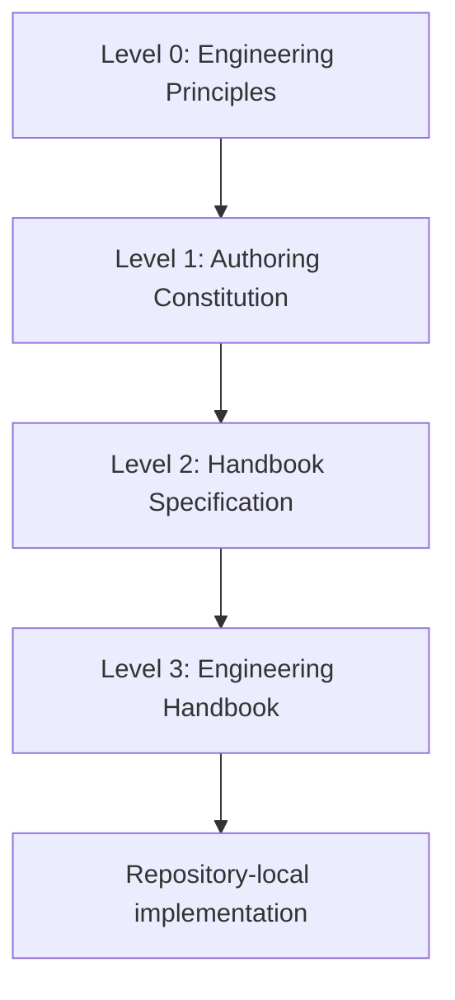
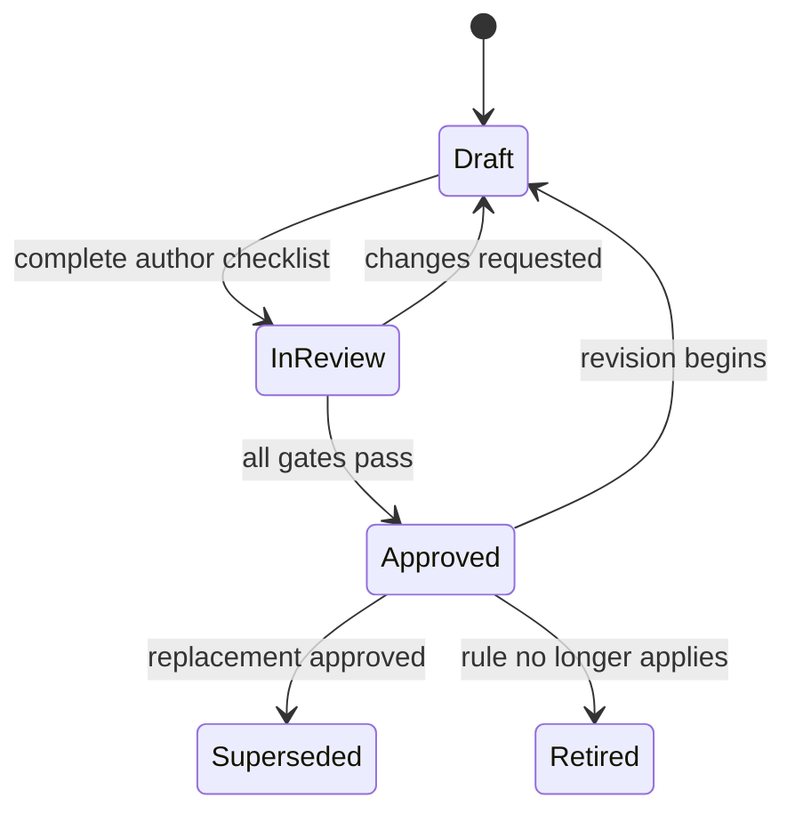

# WeianData Engineering Handbook Specification

| Field | Value |
|---|---|
| Version | 1.0.0 |
| Status | Approved |
| Owner | WeianData |
| Effective date | 2026-07-10 |
| Authority | Level 2 - Handbook Specification |

## 1. Purpose

This specification defines the operational architecture, document model, lifecycle, ownership model, and publication contract of the WeianData Engineering Handbook.

## 2. Scope

It governs the complete handbook repository. Engineering behavior is defined in numbered chapters; this document governs how those chapters form one coherent system.

## 3. Architectural model



Higher levels constrain lower levels. Repository-local instructions MAY become stricter, but MUST NOT reduce handbook requirements.

## 4. Canonical directory structure

```text
handbook/
├── README.md
├── CHANGELOG.md
├── SPECIFICATION/
│   ├── engineering-handbook-master-specification.md
│   ├── handbook-authoring-rules.md
│   ├── engineering-handbook-specification.md
│   ├── handbook-style-guide.md
│   ├── handbook-review-standard.md
│   └── handbook-roadmap.md
├── chapters/
│   ├── 00-engineering-handbook.md
│   ├── 01-company-mission.md
│   └── ...
└── RELEASES/
    └── v1.0-validation-report.md
```

The numbered filename is the stable reading order. Renumbering is a structural change and SHOULD be avoided after publication.

## 5. Document model

Every governed document MUST expose these metadata fields near the title:

| Field | Meaning |
|---|---|
| Version | Semantic version of the document |
| Status | Draft, In Review, Approved, Superseded, or Retired |
| Owner | Accountable role or organization |
| Effective date | Date on which the approved rule takes effect |

Numbered chapters additionally follow the section contract in the [authoring constitution](handbook-authoring-rules.md#7-chapter-contract).

## 6. Status lifecycle



Only Approved documents are normative. Superseded and Retired documents MUST identify their replacement or retirement rationale.

## 7. Rule ownership

| Topic | Owning chapter |
|---|---|
| End-to-end engineering lifecycle | `03-engineering-workflow.md` |
| Repository baseline | `04-repository-standards.md` |
| Git safety and history | `05-git-standards.md` |
| Branch creation and integration | `06-branching-strategy.md` |
| Commit message format | `07-commit-convention.md` |
| Source-code quality | `08-coding-standards.md` |
| Product and code documentation | `09-documentation-standards.md` |
| Release gates | `10-release-process.md` |
| Statistical acceptance | `11-statistical-validation.md` |
| Research lifecycle | `12-research-workflow.md` |
| Reproducibility | `13-reproducibility-standard.md` |
| Simulation design | `14-simulation-standard.md` |
| Performance benchmarking | `15-benchmark-standard.md` |
| Permitted AI use | `16-ai-development-policy.md` |
| Prompt construction | `17-prompt-engineering.md` |
| Multi-agent work | `18-ai-agent-collaboration.md` |
| Review of AI-authored code | `19-ai-code-review.md` |
| AI-reusable knowledge | `20-ai-knowledge-management.md` |
| Security controls | `21-security-policy.md` |
| Client-data handling | `22-client-data-policy.md` |
| Repository ownership and administration | `23-repository-governance.md` |
| Architecture decisions | `24-architecture-decision-records.md` |
| Third-party dependencies | `25-dependency-management.md` |
| Open-source release decisions | `26-open-source-policy.md` |
| New repository scaffold | `27-repository-template.md` |
| README content | `28-readme-standard.md` |
| Issue intake | `29-issue-template.md` |
| Pull request evidence | `30-pull-request-standard.md` |
| Public participation | `31-community-guidelines.md` |
| Names | `32-naming-convention.md` |
| Paths and layout | `33-file-structure-convention.md` |
| Version semantics | `34-versioning-guide.md` |
| Defined terms | `35-glossary.md` |

## 8. Linking and navigation

Links MUST be relative within the repository. A chapter SHOULD link to an owning rule at the point of dependency. The handbook README is the canonical table of contents.

Links MUST NOT target local machine paths, ephemeral branches, or unpublished documents. Renamed headings MUST preserve or update inbound links in the same change.

## 9. Release model

The handbook is released as one versioned system. A release includes:

- all Approved specification files;
- all Approved numbered chapters;
- a complete table of contents;
- a changelog entry;
- a cross-reference and validation report;
- a version tag or equivalent immutable source revision when published.

Individual document versions MAY advance between handbook releases, but the release report MUST record the included state.

## 10. Validation contract

Before publication, the handbook MUST pass:

1. directory and filename validation;
2. required-section validation;
3. metadata validation;
4. relative-link validation;
5. language and placeholder validation;
6. duplicate-rule review;
7. security and confidentiality review;
8. statistical review for relevant chapters;
9. human accountability review;
10. release completeness review.

The detailed procedure is owned by the [review standard](handbook-review-standard.md).

## 11. Extension model

A new chapter requires a clear topic owner, no overlap with existing rule ownership, a stable position in the reading order, and a minor or major handbook version. Repository-specific material SHOULD remain in that repository unless it establishes a reusable company-wide standard.

## 12. Success criteria

The architecture succeeds when a new engineer or AI agent can locate the authoritative rule, understand the required evidence, and execute the standard without hidden organizational knowledge.

