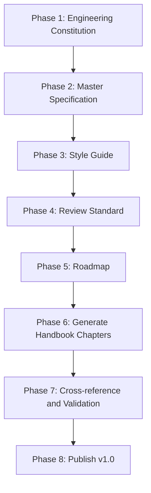

# WeianData Engineering Handbook Roadmap

| Field | Value |
|---|---|
| Version | 1.1.0 |
| Status | Approved |
| Owner | WeianData |
| Effective date | 2026-07-10 |

## 1. Purpose

This roadmap defines the staged creation, publication, adoption, and evolution of the WeianData Engineering Handbook.

## 2. v1.0 publication phases

| Phase | Deliverable | Exit criterion | v1.0 status |
|---|---|---|---|
| 1 | Authoring constitution | Immutable authoring and authority rules approved | Complete |
| 2 | Master and operational specifications | Architecture, ownership, and lifecycle defined | Complete |
| 3 | Style guide | English and Markdown conventions defined | Complete |
| 4 | Review standard | Review gates and evidence defined | Complete |
| 5 | Roadmap | Publication and adoption sequence defined | Complete |
| 6 | Numbered chapters | All planned engineering domains covered | Complete |
| 7 | Validation | Structure, links, coverage, conflicts, and confidentiality checked | Complete |
| 8 | v1.0 publication | Approved files, changelog, and validation report published | Complete |

## 3. Adoption sequence

After v1.1 publication, WeianData SHOULD adopt the handbook in this order:

1. active client projects adopt the client-delivery profile, data classification, and tool-and-data isolation controls;
2. statistical projects adopt validation and reproducibility evidence;
3. AI agents receive the machine-readable task route plus authoritative handbook links;
4. new repositories inherit the repository template and README standard;
5. active repositories align their workflows without rewriting valid history;
6. exceptions and gaps become tracked improvement work.

## 4. v1.1 delivered capabilities

Version 1.1 adds operational enforcement without changing the handbook authority model:

- risk-based Lightweight, Standard, and Controlled operating modes;
- a client-delivery profile and reusable delivery record;
- a one-to-twenty-person team-evolution profile;
- a machine-readable handbook manifest and stable rule registry;
- automated structure, link, manifest, and registry validation in continuous integration;
- a controlled exception-record template.

These profiles and indexes route readers to owning rules; they do not create duplicate standards.

## 5. v1.x maturity goals

- Measure handbook adoption across active repositories.
- Record recurring review findings and simplify unclear standards.
- Add examples from approved, de-identified internal practice.
- Establish scheduled security, dependency, and statistical-method reviews.
- Keep rule ownership stable while improving enforcement.

## 6. v2.0 triggers

A major release SHOULD be considered only when one or more conditions apply:

- the handbook authority model changes;
- repository governance changes incompatibly;
- the company moves from a founder-led operating model to multiple accountable engineering teams;
- a regulated product requires a materially different quality system;
- the handbook directory or chapter contract requires structural redesign.

Growth alone is not a reason for structural redesign. Prefer additive, backward-compatible standards.

## 7. Maintenance cadence

- Review security and client-data standards at least annually and after material incidents or legal changes.
- Review statistical standards when methods, evidence, or intended applications materially change.
- Review AI policy when model capabilities, data handling, or agent autonomy materially change.
- Review the full handbook before each minor or major release.
- Apply patch corrections when an error could mislead implementation.

## 8. Roadmap governance

Roadmap entries MUST identify an outcome, owner, and exit criterion before implementation begins. Dates MAY be added in project planning, but temporary schedules SHOULD remain outside the constitutional specification set.

## 9. Success measures

The roadmap succeeds when:

- new repositories inherit the standards with minimal manual setup;
- client deliveries produce consistent evidence and data controls;
- statistical results can be reproduced independently;
- AI agents can locate authoritative rules without prompt-specific interpretation;
- handbook exceptions and duplicated local policies decline over time.
