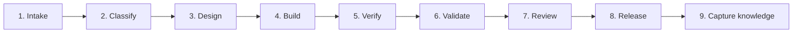

# Engineering Workflow

| Field | Value |
|---|---|
| Version | 1.0.0 |
| Status | Approved |
| Owner | WeianData Engineering |
| Effective date | 2026-07-10 |

## 1. Purpose

This chapter defines the end-to-end lifecycle for engineering work.

## 2. Scope

It applies to product features, client tools, statistical analyses, infrastructure, documentation, and material maintenance changes.

## 3. Philosophy

Work should move through explicit evidence gates. The workflow is lightweight for low-risk changes and rigorous for scientific, security, or client-data changes.

## 4. Principles

- Define the decision and acceptance criteria before implementation.
- Classify scientific, security, data, and operational risk early.
- Keep changes small and reviewable.
- Verify software behavior and validate scientific meaning separately.
- Preserve decisions and reusable knowledge at completion.

## 5. Standards

Every material change MUST produce:

1. an issue or brief stating the problem, scope, owner, and acceptance criteria;
2. a risk classification covering data, security, scientific validity, and reversibility;
3. a design proportionate to risk, with an architecture decision record when required;
4. implementation on a reviewable branch with tests and documentation;
5. software verification evidence;
6. statistical validation evidence when outputs have scientific meaning;
7. an independent review or explicit self-review for low-risk work;
8. release evidence and a rollback or recovery path;
9. captured knowledge, follow-up work, and closed decisions.

No stage MAY be declared complete on the basis of an AI assertion alone.

## 6. Best Practices

- Define stop conditions for experiments and AI-agent tasks.
- Use synthetic or de-identified fixtures early.
- Integrate frequently to reduce review size.
- Automate deterministic checks and reserve human attention for judgment.
- Revisit risk classification when scope changes.

## 7. Examples

### Example: client scoring tool

The issue defines the scoring contract and client execution boundary. Design records the data schema and model assumptions. Development uses synthetic fixtures. Verification checks code behavior; statistical validation checks recovery, fit, and sensitivity. The client runs the approved tool on restricted data in its environment.

## 8. Checklist

- [ ] Problem, owner, scope, and acceptance criteria are defined.
- [ ] Scientific, security, client-data, and operational risks are classified.
- [ ] Design and decisions are recorded at the appropriate depth.
- [ ] Verification and statistical validation are both complete where applicable.
- [ ] Review, release, recovery, and knowledge-capture evidence exists.

## 9. Summary

The workflow turns an engineering request into a reviewed, validated, releasable, and reusable result.

## 10. References

- [Pull Request Standard](30-pull-request-standard.md)
- [Release Process](10-release-process.md)
- [Research Workflow](12-research-workflow.md)

