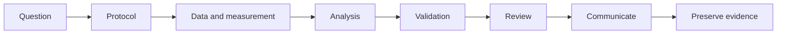

# Research Workflow

| Field | Value |
|---|---|
| Version | 1.0.0 |
| Status | Approved |
| Owner | Research Lead |
| Effective date | 2026-07-10 |

## 1. Purpose

This chapter defines a reproducible workflow from research question to preserved result.

## 2. Scope

It applies to internal research, client analyses, method development, empirical evaluation, and publishable studies.

## 3. Philosophy

Research quality depends on traceable decisions made before, during, and after analysis. Code accelerates research only when question, design, evidence, and limitations remain aligned.

## 4. Principles

- Begin with a decision or research question, not an available method.
- Distinguish confirmatory from exploratory work.
- Preserve provenance from source data to reported result.
- Review measurement quality before substantive interpretation.
- Make changes to the planned analysis visible.

## 5. Standards

Research work MUST record:

- question, decision context, population, constructs, and outcomes;
- protocol, hypotheses, inclusion rules, analysis plan, and deviations;
- data source, permissions, classification, lineage, and transformations;
- measurement instrument, scoring, reliability or precision, and validity evidence;
- analysis code, environment, diagnostics, uncertainty, and sensitivity;
- review findings and accountable approval;
- report, tables, figures, and a reproducibility manifest.

Client restrictions MAY prevent source-data distribution. In that case, the project MUST preserve executable code, schemas, synthetic fixtures, environment information, and client-side execution evidence without transferring restricted data.

## 6. Best Practices

- Create the analysis plan and output shell before final data access.
- Use immutable raw inputs and versioned transformations.
- Keep exploratory notebooks separate from production pipelines.
- Generate tables and figures from code rather than manual editing.
- Maintain a decision log for deviations and failed approaches.

## 7. Examples

### Example: large-scale survey analysis

The protocol defines target estimates and subgroup comparisons. The pipeline validates weights and response coding, records exclusions, evaluates measurement invariance, generates outputs from locked code, and runs inside the client's restricted environment. Only approved aggregate results leave that environment.

## 8. Checklist

- [ ] Question, population, constructs, outcomes, and protocol are explicit.
- [ ] Data permissions, lineage, measurement, and transformations are documented.
- [ ] Confirmatory and exploratory work are distinguished.
- [ ] Analysis, diagnostics, sensitivity, and uncertainty are reproducible.
- [ ] Deviations, review, communication, and preservation are complete.

## 9. Summary

The research workflow preserves the connection between question, measurement, data, analysis, evidence, and conclusion.

## 10. References

- [Client Data Policy](22-client-data-policy.md)
- [Statistical Validation](11-statistical-validation.md)

